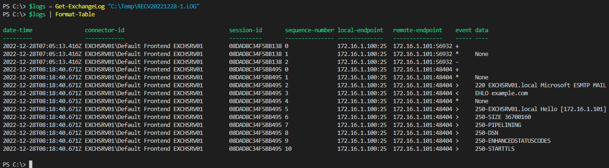

# ExchangeServer
Resources for use with Microsoft Exchange Online &amp; On Premises PowerShell

## [Get-ExchangeLog.ps1](Get-ExchangeLog)

2023-02-07
ian-mor

Simple function to easily import Exchange Server logs for analysis.  The function skips all comment rows and uses the field data defined in the comments to dynamically assign column names.

    
---

A script a day keeps the work away!  ~ian-mor
